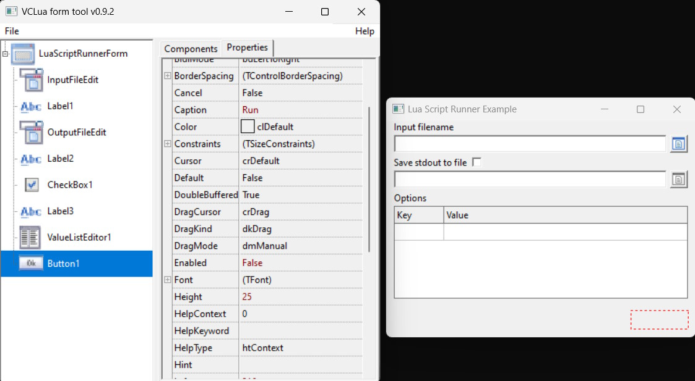

# VCLua tools

## vt-forms
This small application allows you to create and design vclua forms easily.

 {:height="600px" width="400px"}.

_Requirements:_
 - vclua (v.0.9.2 or higher)
 - lua json library
 - lua log library

_Features:_
 - Drag and drop component  in to the forms component tree
 - Set component properties via property editor
 - Form preview
 - Component position fine tuning on the preview form
 - Saving and loading forms in JSON format

#### loading form from json file    
```lua
    local VCL = require "vcl.core"
    local json = require "json"
    VCL.Application():Initialize()
    
    function jsonFormLoad(fileName) 
    	local file, errorString = io.open( fileName, mode or "r"  )
    	assert(file,string.format("%s not found!", tostring(fileName)))
    	local contents = file:read( "*a" )
    	io.close( file )
    	local frm = json.decode(contents)
    	local comp = {}
    	for n,c in pairs(frm) do
    		if VCL[c.class]~=nil then
    			comp[c.name] = VCL[c.class](comp[c.parent],c.name,c.props)
    		end
    	end
    	return comp
    end
    
    local mainFormName = "MyForm"
    local jForm = jsonFormLoad("myform.json")
    
    jForm[mainFormName]:ShowModal()
```
### convert json form to lua script
Converts vt-form tool's output to lua script.
[json2lua.lua](utils/json2lua.lua)
Usage:
```
 lua json2lua.lua json_filename > lua_scriptname
 ```
