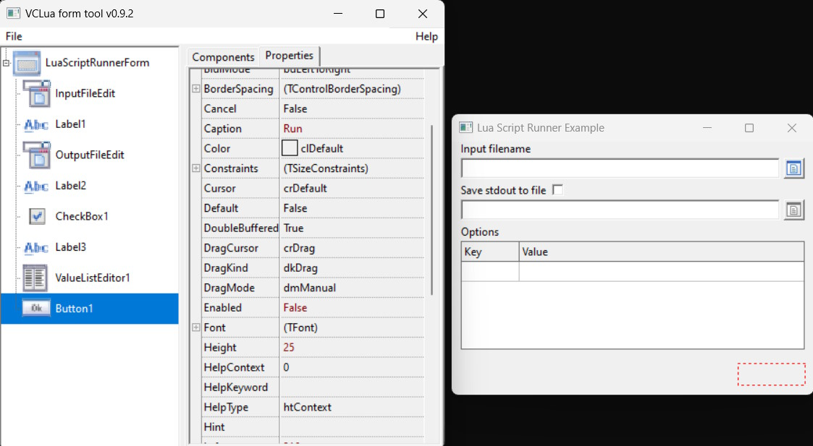

# VCLua tools

## vt-forms
This small application allows you to create and design vclua forms easily.



_Requirements:_
 - [vclua](https://github.com/hipbali/vclua) (v.0.9.2.338 or higher)
 - [lua json library](https://github.com/rxi/json.lua)
 - [lua log library](https://github.com/rxi/log.lua)

_Features:_
 - Drag and drop component  in to the forms component tree
 - Set component properties via property editor
 - Form preview
 - Component position fine tuning on the preview form
 - Saving and loading forms in JSON format

_Source code:_
 - [src](src/)

_Luajit distro:_
 - [luajit with lar distro](dist/)

_Lua5.4 distro:_
 - [lua5.4 with lar distro](dist54/)
   
#### loading form from json file

Ensure `copy.lua`, `json.lua`, `loader.lua` and the library are in appropriate places. Then:

```lua
    VCL = require "vcl.core"
    VCL.TheApplication():Initialize()
    require "loader"
    
    local mainForm, componentsByPath, jForm = jsonFormLoad("img2lua.json")
    -- or, if the components have unique names
    -- local mainForm, componentsByPath = jsonFormLoad("img2lua.json", _G)
    mainForm:ShowModal()
```

### convert json form to lua script
Converts vt-form tool's output to lua script.
[json2lua.lua](utils/json2lua.lua)

Usage:
```
 lua json2lua.lua json_filename > lua_scriptname
 ```
