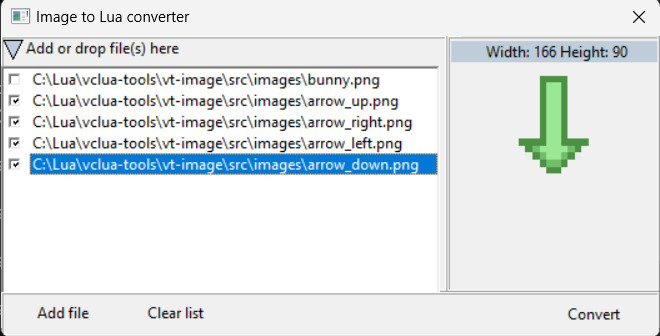

# VCLua tools

## vt-image
This small application allows you to convert images (bmp,jpg,png) to hexstrings.



_Requirements:_
 - [vclua](https://github.com/hipbali/vclua) (v.0.9.2 or higher)
 - [lua json library](https://github.com/rxi/json.lua)

_Features:_
 - Drag and drop images to checklistbox
 - Add image via OpenDialog
 - Image preview
 - Saving selected image(s) as lua table

_Source code:_
 - [src](src/)
   
#### loading image content from hexdata    
```lua
    function loadHexImage( img, hexdata) 
    	local str = VCL.Stream()
    	local memStr,size = str.LoadFromHex(hexdata)
    	img.picture:LoadFromStream(memStr) 	
    	memStr:Free()
    	str:Free()
    end
```

